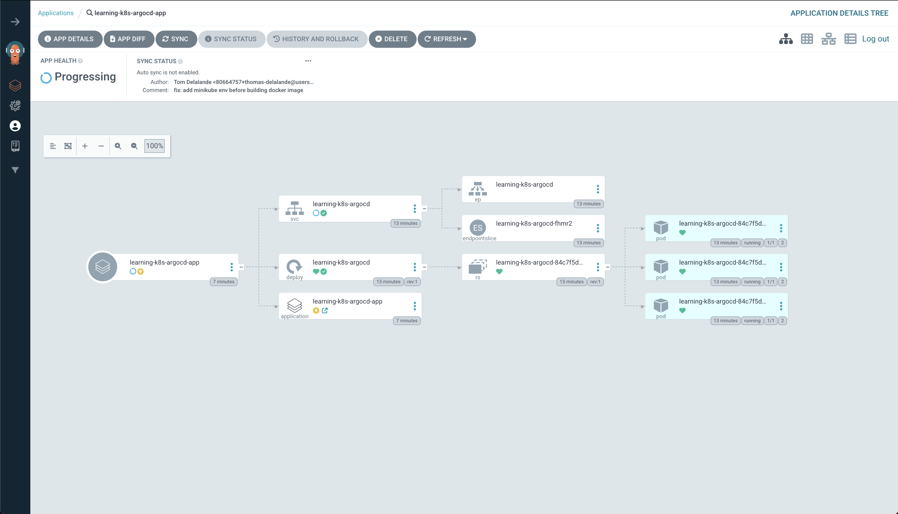
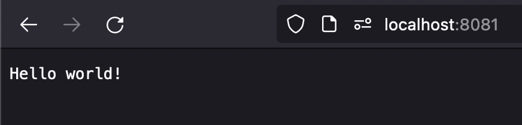

This is a minimal project to configure Kubernetes and ArgoCD.

## Prerequisites

Running this as is requires the following dependencies:

- `argocd`
- `kubectl`
- `docker`
- `minikube`
- `go`

## Usage

```bash
./scripts/setup.sh

# To access the ArgoCD UI on localhost:8080
./scripts/port-forward-argocd-ui.sh

# Once synchronised, to access the server on localhost:8181
./scripts/port-forward-server.sh

# To remove resources and stop minikube
./scripts/teardown.sh
```

## Result

### ArgoCD UI



### Server Response




## Todo

- Setup a persistent database alongside Kubernetes
- Setup secret management using Kubernetes
- Setup remote kubernetes cluster
